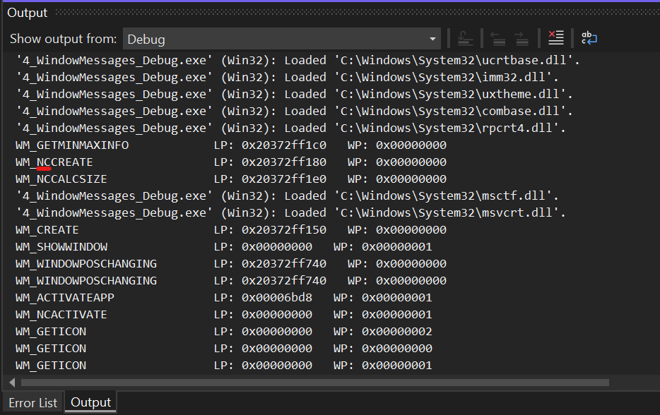
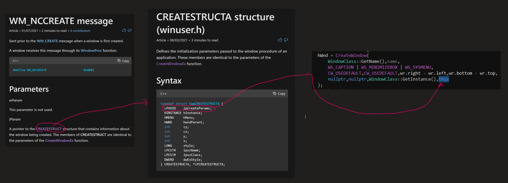
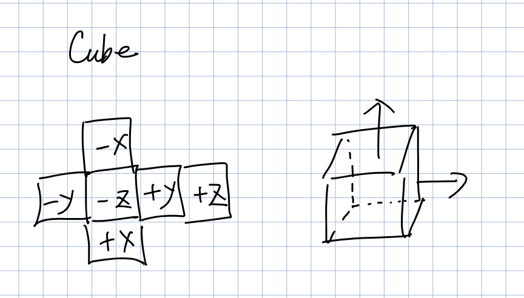

[toc]

Tech stack: Win32 + C++

## 

```c++


```

# Invert Normal Bug


# DirectX 11 vs 12

https://www.gamedev.net/forums/topic/701369-directx11-or-directx12/

# Constant buffer slot debugging

https://gamedev.stackexchange.com/questions/86818/how-does-direct3d-know-if-a-constant-buffer-is-for-the-vertex-or-pixel-shader

> Once you get to more advanced shaders that reference multiple `cbuffer`s, you'll want to get into the habit of assigning slots explicitly.


## Debugging Steps


1. The size of the constant buffer at slot 0 of the pixel shader unit is too small (**16 bytes provided**, ...). Since we know the allocation size is 16 bytes, we can figure out which buffer is causing the issue by setting a conditional breakpoint on the buffer creation function. 


2. By looking at the call stack, we can know which buffer is causing the issue. 

## Takeaway

If multiple pixel shaders exists in the same pipeline, their constant buffers must have distinct slots. For example: 

Pixel shader 1: 

```c++
cbuffer LightCBuf : register(b0)
{
...
};

cbuffer ObjectCBuf : register(b1)
{
...
};

float4 main(float3 posCamSpace : Position, float3 normalCamSpace : Normal) : SV_Target
{
...
}

```

Pixel shader 2: 

```c++
cbuffer CBuf : register(b2)
{
	float4 color;
};

float4 main() : SV_Target
{
	return color;
}
```

Note: these 3 constant buffer each has a distinct slots. We need to bind to the right slot in C++ side. 


# C++ 3D DirectX Tutorial [Introduction] 1

## Introduction

 Build a 3D engine from scratch using **DirectX 11**

## Direct3D 11 vs D3D12/Vulkan


## Syllabus (Overview of Topics)


- WinAPI
  - how to create a window and process messages mainly relating to keyboard and mouse input
- initialization of the pipeline components required to draw primitives
- Once we have a basic pipeline down, we will begin a deep dive, learning HLSL together with important rendering techniques
- After getting familiar with HLSL, the binding of various resources to shader stages, and mastering important pixel shader and vertex shader techniques, we will broaden our horizons with tesselation/geometry shaders and try out had at fullscreen post-processing techniques as well
- explore more advanced techniques such as dynamic shadows and deferred lighting


## Prerequisites/Requirements


## Resources/Community

https://forum.planetchili.net/index.php

## Last Request/Support

# C++ 3D DirectX Tutorial [WinMain] 2

## Visual Studio Projection Creation and Configuration

- Win32 Project Build Settings


Release only: 


Debug only: 


- Why use Runtime library to `/MT` and `/MTd`? 

It allows us to run our executable without installing *Microsoft C++ Runtime*

## WIndows Application Entry Point

- Unlike **console app**, **Win32 app** has the following entry point: 

```c++
#include <Windows.h>

// let's build a minimal win32 Application

// when you are making a Windows application,
// the entry point is "WinMain", not "main"
int WINAPI WinMain(
	_In_ HINSTANCE hInstance,
	_In_opt_ HINSTANCE hPrevInstance,
	_In_ LPSTR lpCmdLine,
	_In_ int nShowCmd)
{
	while (true);
	return 0;
}

// If you run this code, we get nothing. The program stucks at infinite while loop
```

It is interesting to note that there are a whole bunch of codes (create a window for the console, handle keyboard input, attach standard input/output stream, etc.) added to **console apps** in order to spawn a usable console for us. 

## Windows API Class / Instance System

- To create a **Direct 3D device**, you need to use **Win32** to create a window.  
- We follow the following steps to create a window using **Win32**: 

*(Call a function to)* Register a *(single)* **Windows class** *(on Win32's side)*: defines Windows properties, styles, behaviors, etc. 

*(Call another function to)* Create a **instance of the Windows class**: this is the actual window that we can manipulate on the screen. 

# C++ 3D DirectX Tutorial [Window Creation] 3

## Win32 Entry Point Parameters

```c++
int WINAPI WinMain(
	_In_ HINSTANCE hInstance,
	_In_opt_ HINSTANCE hPrevInstance,
	_In_ LPSTR lpCmdLine,
	_In_ int nShowCmd)
{}
```

- `hInstance`

A handle to the current instance of the application

We can ignore this, because `GetModuleHandle(nullptr)` will return the handle for us. We pass in `nullptr` to get a handle to the file used to create the calling process (.exe file). https://docs.microsoft.com/en-us/windows/win32/api/libloaderapi/nf-libloaderapi-getmodulehandlea

- `hPrevInstance`: Always `NULL `
- `lpCmdLine`

Contains the command-line arguments as a single Unicode string. 

Notice that it's different than the standard C/C++ entry point where you access command line arguments through `int argc, char** argv`. 

- `nShowCmd`

A flag that says whether the main application window will be minimized, maximized, or shown normally (ignore this). 

- `WINAPI`

A function modifier that tell C++ to use **WinAPI** calling convention (`stdcall`) for this function, which passes parameters on the stack differently than standard C calling convention (`cdecl`)

- return value: 0 success, o.w. there is a problem 

**Any functions created that needs to be called by Win32 API must have this calling convention**

## Registering Window Class and Creating WIndow Instance

```c++
int WINAPI WinMain(
	_In_ HINSTANCE hInstance,
	_In_opt_ HINSTANCE hPrevInstance,
	_In_ LPSTR lpCmdLine,
	_In_ int nShowCmd)
{
	const auto pClassName = "hw3dbutts";

	// specify window class config structure
	WNDCLASSEX wc = {
		// fill with the size of the WNDCLASSEX structure
		.cbSize = sizeof(wc),
		// give each window its own device context (DC)
		// (useful if we want to spawn multiple windows for our application) 
		.style = CS_OWNDC,
		// a pointer to a function that handles all messages for this window,
		// that determines the behavior of the window and how window looks
		// use default windows procedure (later we will create our own procedure)
		.lpfnWndProc = DefWindowProc,
		// we don't need any extra data to be stored in WinAPI
		.cbClsExtra = 0,
		.cbWndExtra = 0,
		// a handle to the instance that contains the window procedure for the class
		.hInstance = hInstance,
		.hIcon = nullptr,
		.hCursor = nullptr,
		.hbrBackground = nullptr,
		.lpszMenuName = nullptr,
		// specify the window class name
		.lpszClassName = pClassName,
		.hIconSm = nullptr,
	};

	// register window class
	RegisterClassEx(&wc);
    
    // ----------------------------------------------------------------------------------------------------------------
    
	// create window instance
	// https://docs.microsoft.com/en-us/windows/win32/api/winuser/nf-winuser-createwindowexa
	HWND hWnd = CreateWindowEx(
		// choose extended window style (we don't care for now)
		0,
		// class name
		pClassName,
		// name
		"Happy Hard Window",
		// style
		WS_CAPTION | WS_MINIMIZEBOX | WS_SYSMENU,
		// position
		200,
		200,
		// size 
		640,
		480,
		nullptr,
		nullptr,
		// instance handle
		hInstance,
		nullptr
	);
	// show the damn window
	ShowWindow(hWnd, SW_SHOW);
	while (true);
	return 0;
}
```


## WinAPI Functions - A vs. W vs. Ex Versions

When you type your **WinAPI** code, you will find many versions of the same function pop up in your Intellisense. For example, if you type `CreateWindow`, you will see `CreateWindow`, `CreateWindowA`, `CreateWindowW`, `CreateWindowEx`, `CreateWindowExA`, and `CreateWindowExW`. 

- Functions that end with `A` means that they are **multibyte (ANSI)** versions
- Functions that end with `W` means that they are **Unicode (Wide)** version
- Functions that end with `Ex` means that they are **extended** versions of pre-existing functions
- Functions that end with nothing will try to resolve to either A or W versions depending on a preprocessor setting

# C++ 3D DirectX Tutorial [Message Loop / WndProc] 4

Last time, we were able to create a window using Win32 API. However, **the window is not responsive**. In order to make it responsive to our input, we need to **get, dispatch, and process messages**. 

## Event-Driven programming vs. Game Loop

- Game loop: Game loop constantly spits out frames at (hopefully) constant rate, no matter how the game state changes
- Notepad: When you are not clicking the notepad window, notepad is static (isn't processing any frames or redrawing itself). When you click the window, the status changes (cursor is blinking, etc), then it will go back to sleep again. When you start to type letters, keyboard events are sent to Notepad, which will process them (possibly redraw the screen or put data into buffer). **In conclusion, at most time, Notepad is sleeping and waiting for events.** It is very efficient, b/c when you are doing nothing, you don't need to redraw the screen (at 60FPS, like game loop). **Notepad is event-driven.** 

Next, let's take a look at **Windows message**, which is also **event-driven**. 

## Windows Message Processing Flow


## Creation of `GetMessage` Pump and Custom Window Procedure

```c++
// custom window procedure for message handling
// Notice: This function will be called by Win32 API, thus we need to have WINAPI calling convention
LRESULT WINAPI WndProc(
    // Handle to the window
    HWND hWnd, 
    // A message number that tells you what type of the message is
    UINT msg, 
    // Context-dependent data for different messages, e.g. if msg == WM_KEYDOWN, wParam is the virtual keycode
    WPARAM wParam, 
    // Context-dependent data for different messages
    LPARAM lParam)
{
	// custom message handling: 
	switch (msg)
	{
	case WM_CLOSE:
		// push a quit message exit code = 69 to the message queue
		// when you destroy the window, the exit code will be sent to msg.wParam
		PostQuitMessage(69);
		break;
	}

	// retain certain default behavior (like destroying the current window)
	return DefWindowProc(hWnd, msg, wParam, lParam);
}

int WINAPI WinMain(
	_In_ HINSTANCE hInstance,
	_In_opt_ HINSTANCE hPrevInstance,
	_In_ LPSTR lpCmdLine,
	_In_ int nShowCmd)
{
	const auto pClassName = "hw3dbutts";
    WNDCLASSEX wc = {
...
        // Note: here we change to our customized window procedure
        .lpfnWndProc = WndProc,
...
    };
    
...
	ShowWindow(hWnd, SW_SHOW);

	// -----------------------Creation of Message Pump---------------------------------

	// declare message structure that holds message data
	MSG msg;

	// declare a BOOL for the result of GetMessage
	BOOL gResult;

	// pull one of the messages from message queue
    // we continue to do this until we retrieve a WM_QUIT message or encounter an error
	while ((gResult = GetMessage(
		// fill the message struct
		&msg,
		// we want to get all messages regardless of which window they come from
		nullptr,
		// specify the range of message number we want to pull off from the message queue
		// we want to process all messages, so they both are 0 
		0,
		0)) > 0)
	{
		TranslateMessage(&msg);
		DispatchMessage(&msg);
	}
	
    // If there is an error, GetMessage returns -1
	if (gResult == -1)
	{
		// error!
		return -1;
	}

	// return our postQuitMessage error code
	return (int)msg.wParam;
}

```

# C++ 3D DirectX Tutorial [Window Messages] 5

## Windows Message Logger: `WindowsMessageMap`

In order to survey what messages are sent to our window, we create a new class `WindowsMessageMap` to help us with that. 

Usage: 

```c++
LRESULT WINAPI WndProc(HWND hWnd, UINT msg, WPARAM wParam, LPARAM lParam)
{
	static WindowsMessageMap mm;
	// output the formatted message string to the debug window (Output => Show output from Debug)
	OutputDebugString(mm(msg, lParam, wParam).c_str());
...
}
```

Output from **Debug** Tab: 



`NC`: nonclient region 

What does non-client mean? 


## `WM_KEYDOWN`, `WM_KEYUP`, and `SetWindowText()`

```c++
LRESULT WINAPI WndProc(HWND hWnd, UINT msg, WPARAM wParam, LPARAM lParam)
{
...
	switch (msg)
	{
	case WM_CLOSE:
		PostQuitMessage(69);
		break;
	case WM_KEYDOWN:
		// wParam represents the keycode of the key being pressed
		// if the key is pressed down: 
		if (wParam == 'F')
		{
			// change the window title text
			SetWindowText(hWnd, "Respects");
		}
		break;
	case WM_KEYUP:
		// if let go the key:
		if (wParam == 'F')
		{
			SetWindowText(hWnd, "Dangerfield");
		}
		break;
	}

	return DefWindowProc(hWnd, msg, wParam, lParam);
}
```

# C++ 3D DirectX Tutorial [WM_CHAR / Mouse] 6

This episode concludes our exploration of window message with `WM_CHAR` and mouse messages

## `WM_CHAR` and `WM_LBUTTONDOWN`, and `POINTS`, `MAKEPOINTS`

```c++
LRESULT WINAPI WndProc(HWND hWnd, UINT msg, WPARAM wParam, LPARAM lParam)
{
...
	switch (msg)
	{
...
	case WM_CHAR:
		// WM_CHAR is a message for text input. This is very different from WM_KEYDOWN/UP. 
		// This is only emitted when you type text characters, e.g. F1 key won't emit this msg
		{
			static std::string title;
			// wParam, in this case, is the ASCII code for the text character
			title.push_back((char)wParam);
			SetWindowText(hWnd, title.c_str());
		}
		break;
	case WM_LBUTTONDOWN:
		{
			// output coordinate of the mouse to our window title 
			const POINTS pt = MAKEPOINTS(lParam);
			std::ostringstream oss;
			oss << "(" << pt.x << "," << pt.y << ")";
			SetWindowText(hWnd, oss.str().c_str());
		}
		break;
	}
...
}
```

##  `TranslateMessage()`

```c++
int WINAPI WinMain(
	_In_ HINSTANCE hInstance,
	_In_opt_ HINSTANCE hPrevInstance,
	_In_ LPSTR lpCmdLine,
	_In_ int nShowCmd)
{
...
	while ((gResult = GetMessage(
		&msg,
		nullptr,
		0,
		0)) > 0)
	{
		// this function is responsible for generating WM_CHAR messages
         // It will post auxiliary WM_CHAR messages from key msgs
		// If you don't need WM_CHAR messages, you can comment this out
		TranslateMessage(&msg);

		DispatchMessage(&msg);
	}
...
}
```

## Difference between `WM_CHAR` and `WM_KEYUP/DOWN`

- Use `WM_CHAR` when you type in words or sentences
- Use `WM_KEYDOWN/UP` when you use WASD to control characters in a game

# C++ 3D DirectX Tutorial [Window Framework] 7

## Creation of `WinHelper.h`

Why do we create `WinHelper.h`?

We do this to avoid directly `#include <Windows.h>`, b/c it will mess up some of our functions. 

For example, `#define NOMINMAX` helps us to avoid naming collision with `std::min` and `std::max`

Whenever we need to `#include <Windows.h>`, we `#include "WinHelper.h`.

## Creation of `Window` Class Framework `DXWindow.h/cpp`


Noteworthy: 

- We've also introduced a mechanism by which a member function `DXWindow::HandleMsg` is hooked into the Windows message handling system via a 2-stage thunking system (`DXWindow::HandleMsgSetup` + `DXWindow::HandleMsgThunk`)
- What is `WM_NCCREATE` and why are we interested in it? We use it to extract our own Window class pointer. 



# C++ 3D DirectX Tutorial [Custom Icons / Error Handling] 8

In this episode, we add error handling to our system. 

## Exception throwing/handling system for API errors: `DXException.h/cpp`

## Custom window/application icons

Handling app icon with cmake: 

- firstly, you need to let Visual Studio generate `.rc` and `resource.h` files. You need BOTH files
- Then, 

```cmake
# add application icon
set(APP_ICON_RESOURCE_WINDOWS "${CMAKE_CURRENT_SOURCE_DIR}../../../shared/appico.rc")

# Note: WIN32 is added here by Chili tutorial
add_executable(${PROJECT_NAME} WIN32 ${SRC_FILES} ${HEADER_FILES} ${APP_ICON_RESOURCE_WINDOWS})
```


# C++ 3D DirectX Tutorial [Keyboard / WM_SYSKEYDOWN] 9

## Encapsulation of Access to the Keyboard Input  `Keyboard.h/cpp`


# C++ 3D DirectX Tutorial [Mouse / Mouse Capture] 10

## Encapsulation of Access to the Keyboard Input  `Mouse.h/cpp`

Now our window subsystem is complete!

# C++ 3D DirectX Tutorial [App class / PeekMessage]11

## Creation of `App` Class  `App.h/cpp`


## Creation of  Timer class `Timer.h/cpp`

## `PeekMessage` vs `GetMessage`

`GetMessage` while loop issue: 

```c++
int App::Go()
{
    ...
    // What happen to GetMessage if there are no messages? 
    // GetMessage will block the application and wait for messages to come in
    // It will "wait for input events" as shown in the following picture
    // Thus we should NOT use GetMessage for our game loop
    while ((gResult = GetMessage(&msg, nullptr, 0, 0)) > 0)
    {
       ...
    }
    ...
}
```

What should we use for game loop? `PeekMessage` !

```c++
while (PeekMessage(
    &msg, 
    nullptr, 
    0, 
    0,
    // remove the message from the queue like GetMessage, but return immediately if there is no messages in the queue
    PM_REMOVE))
{
    ...
}
```

Also, the return value between `GetMessage` and `PeekMessage` are also very different:

- `GetMessage` returns a value that signals whether there is a quit message (>0, <= 0 are possible)
- `PeekMessage` returns a value that signals if there is a message at all. (`BOOL`: true or false)

# C++ 3D DirectX Tutorial [COM (Component Object Model)]12

Direct3D 11 is mostly interfaced with as a collection of **COM (Component Object Model)** objects. In this tutorial we learn about the fundamental concepts and techniques of Microsoft COM.

Lots of Microsoft technologies are based on COM technologies: 


## Binary Compatibility

C++ is designed to reuse software components (classes) via source code, not via compiled binary objects, because C++ standard doesn't dictate layouts of its binary data. Thus, most often, you cannot share binary between different compilers (such as `MSVC` and `gcc`). 

For example, we have 2 different compilers `pubesC++` and `cuckpp` that handles the storage of `vtable` differently: 


Then, we try to use a `dll` generated by `pcubes` inside a project that uses `cuckcpp`:


 As a result, we will access unrelated memory in this case. 

**Binary are not compatible between different C++ compilers !**

## Motivation of COM

COM is a standard for creating and interfacing with reusable software objects at binary level. Client and server objects can be developed with different development environment s and in different languages. **It provides binary compatibility that C++ doesn't have.** 

## Features of COM

- **Language agnostic**: as long as languages support function pointers, they will be able to access COM objects. As long as they provide control over memory layout, they can also be used to create COM objects
- COM has its own independent **resource allocation**
- **Factory functions**  give you a language independent way of creating objects in memory. Every COM object has a **unique ID**. You can pass ID to factory, and factory will look into central registry to find the object, create the object for you, and return a handle to the object to you (**interface**). 
- Encapsulation, thread safety, distributed...

## Interface Software Engineering Concept

Anything that implements `IPunchable` will have to implement all functions declared in `IPunchable`. 


`Punch(IPunchable&)` can take anything that is `Puchable`. 

In C++, there is not `interface` keyword . We do it by creating purely abstract classes with pure virtual functions. 


## Factory, Interface, and Ref Counting


## QueryInterface


## Layout of COM Objects


## Demo of using COM to retrieve wall paper

```c++
#include <Windows.h>
#include <Wininet.h>
#include <ShlObj.h>
#include <iostream>

// let's see an example of consuming a COM object

// The following code retrieves the path of the Windows wall paper and
// create a shortcut to it

// Note: this only works if you've set a wall paper (solid color won't work)

int main()
{
	// initialize COM subsystem (we don't need to do this in D3D)
	CoInitialize(nullptr);

	// declare a pointer to the interface
	IActiveDesktop* pDesktop = nullptr;

	// create a buffer that holds the desired data
	WCHAR wszWallpaper[MAX_PATH];

	// create COM object (through a factory function)
	CoCreateInstance(
		// ID for the underlying object type you're creating 
		CLSID_ActiveDesktop,
		// a pointer to an outer object (we're not using it)
		nullptr,
		// specify the context of the object we're creating
		CLSCTX_INPROC_SERVER,
		// pass in UUID of the interface that you want the function returns 
		__uuidof(IActiveDesktop),
		// output handle for the interface
		reinterpret_cast<void**>(&pDesktop)
	);

	// fill the buffer with the name of the wall paper
	pDesktop->GetWallpaper(wszWallpaper, MAX_PATH, 0);
	// remember to release the resource
	pDesktop->Release();

	// print out the path of the wall paper
	// this will only show up if you've actually set the wall paper
	std::wcout << wszWallpaper;

	// create a link to the wall paper
	IShellLink* pLink = nullptr;
	CoCreateInstance(
		CLSID_ShellLink,
		nullptr,
		CLSCTX_INPROC_SERVER,
		__uuidof(IShellLink),
		reinterpret_cast<void**>(&pLink)
	);

	// convert wide string to narrow string
	char path[2000];
	wcstombs(path, wszWallpaper, 2000);
	pLink->SetPath(path);

	// create a shortcut to the wall paper:
	IPersistFile* pPersist = nullptr;
	pLink->QueryInterface(__uuidof(IPersistFile), reinterpret_cast<void**>(&pPersist));
	pPersist->Save(L"D:\\wallpaper.lnk", FALSE);

	pPersist->Release();
	pLink->Release();

	CoUninitialize();
	std::cin.get();
	return 0;
}

```


# C++ 3D DirectX Tutorial [D3D Architecture / Swap Chain] 13

Before diving straight into the Direct3D 11 code, we look at the overall object architecture of D3D, the process of initializing the core objects, and some specific concepts such as the swap chain and feature level vs. API version.

## Direct3D Architecture 

Direct3D has an **object-oriented architecture** that builds on top of COM, where objects represent different entities (shaders, textures, rendering states, etc) in the 3D rendering system. The mother of all these entities are called **Direct3D Device**.

- **Device** represents the logical graphics card, backed by physical graphics card or software emulation layer. It can be created using `D3D11CreateDevice`. We use device object to create all the objects necessary for rendering and allocate resources if necessary. Many of these objects can be used to create more objects. For example, **Swap chain** generally contains multiple frame buffers. You can create objects to get access to those frame buffers that are aggregated in the swap chain. 
  - To create device and swap chain together, we use `D3D11CreateDeviceAndSwapChain`.
- You can also get **view** on the resources that can be used to bind the resources to the shader pipeline. 

 Let's explore the architecture: 


## DXGI API vs. Direct3D API

DXGI represents a set of functionalities that rarely change between versions of Direct3D. 

## Direct3D Context

Immediate vs Deferred Context 

Deferred context allows us to create multithreaded command lists. 

# C++ 3D DirectX Tutorial [Device Init / Fill Screen / Present]14

In this video we create the mother of all D3D11 objects--the **device**. We also learn how to present the backbuffer (flip/swap) and how to fill the screen with a solid color, and we create a nifty little `class Graphics` to hold all this **bullshit**.

## `Graphics` Class


# C++ 3D DirectX Tutorial [Debug Layer Diagnostics]15

**Error reporting and rich diagnostics**. These are what separate a professional engineer's approach to tackling a new API from the finger-up-butting of an amateur. We've also added several `Exception` classes to both `Window.h/cpp` and `Graphics.h/cpp`, and macros to facilitate error reporting.  

## `dxerr.h/cpp`

We added `dxerr.h/cpp` (with axillary files `*.inl`) to support error reporting for Win7+, These files provide macros like `DXGetErrorString` and `DXGetErrorDescription` for us to use in `Exception` classes to retrieve error description and string.

## `DxgInfoManager.h/cpp`

Once we enable D3D debug layer, we want to pass the debug info from the layer to our exception window. Thus, we use `DxgInfoManager.h/cpp` to to extract useful messages from Direct3D Device Debug Layer. And then transfer that message into our custom debug window

# C++ 3D DirectX Tutorial [`ComPtr` Smart Pointer]16

**Smart pointers make everything better**. There is a smart pointer for COM interfaces called `ComPtr`. We are going to use the *fuck* out of this beautiful bastard. We deprecate raw pointers in all our classes and use `ComPtr` instead. 

## `ComPtr` vs. `unique_ptr`

Why use `ComPtr` instead of `std::unique_ptr`? 

- Firstly, `std::unique_ptr` calls `delete` to release the resource. However, `COM` objects requires us to call `Release()`. Thus, to use `std::unique_ptr` with `COM` objects, we need to provide a custom deletor to call `Release()`. `ComPtr` will handle this for us. 
- Secondly, to give COM factory function your interface pointer, you need to use `&something`. With `ComPtr`, `&` operator is overloaded to retrieve the address of the encapsulated pointer.  However, with unique pointer, `&` is not overloaded. Thus, `&` will not give what you want.  
- Thirdly, `COM` object utilizes reference counting. Unique pointer doesn't have that. 

## `operator&` overload surprise

Special treatment when calling `&` on `ComPtr`:

- Calling `&` on `ComPtr` has special treatment. **if `ComPtr` is currently owning a `COM` object,  it will first call `Release()` on the COM object before it returns the address of the underlying pointer.** This makes sense, because you don't want to leak memory. However, sometimes we just want to retrieve address of the pointer without releasing the resources it points to. In this case, instead of using `&`, we need to call `GetAddressOf()`. PS: `&` is the same as `ReleaseAndGetAddressOf()`. 

# C++ 3D DirectX Tutorial [First Triangle] 17-18

## Graphics Pipeline of D3D11


## First Triangle


```c++
void Graphics::FirstTriangle()
{
	HRESULT hr;

	// ----------------------------Vertex Buffer Stage-------------------------------------
	struct Vertex
	{
		float x;
		float y;
	};

	// create vertex buffer (See Markdown for visual)
	const Vertex vertices[] =
	{
		{0.0f, 0.5f},
		{0.5f, -0.5f},
		{-0.5f, -0.5f},
	};

	wrl::ComPtr<ID3D11Buffer> pVertexBuffer;

	// Describes a buffer resource
	D3D11_BUFFER_DESC bd = {
		// Size of the buffer in bytes
		.ByteWidth = sizeof(vertices),
		// Identify how the buffer is expected to be read from and written to
         // This resource requires read and write access by the GPU
		.Usage = D3D11_USAGE_DEFAULT,
		// Identify how the buffer will be bound to the pipeline
		.BindFlags = D3D11_BIND_VERTEX_BUFFER,
		// CPU access flags
		.CPUAccessFlags = 0u,
		// Miscellaneous flags
		.MiscFlags = 0u,
		// The size of each element in the buffer structure (in bytes) when the buffer represents a structured buffer
		.StructureByteStride = sizeof(Vertex),
	};

	// Specifies data for initializing a subresource
	D3D11_SUBRESOURCE_DATA sd = {
		// Pointer to the initialization data
		.pSysMem = vertices,
		// The distance (in bytes) from the beginning of one line of a texture to the next line
		.SysMemPitch = 0u,
		// The distance (in bytes) from the beginning of one depth level to the next
		.SysMemSlicePitch = 0u,
	};

	// Creates a buffer (vertex buffer, index buffer, or shader-constant buffer)
	GFX_THROW_INFO(pDevice_->CreateBuffer(
		// A pointer to a D3D11_BUFFER_DESC structure that describes the buffer
		&bd,
		// A pointer to a D3D11_SUBRESOURCE_DATA structure that describes the initialization data
		&sd,
		// Address of a pointer to the ID3D11Buffer interface for the buffer object created.
		&pVertexBuffer));

	const UINT stride = sizeof(Vertex);
	const UINT offset = 0u;

	// Bind an array of vertex buffers to the input-assembler stage.
	pContext_->IASetVertexBuffers(
        // You get one vertex buffer per slot (with max slot = 16 or 32)
		// The first input slot for binding
		0u,
		// The number of vertex buffers in the array
		1u,
		// A pointer to an array of vertex buffers (Pay special attention here: DO NO USE & OPERATOR!)
		pVertexBuffer.GetAddressOf(),
		// Pointer to an array of stride values
		&stride,
		// Pointer to an array of offset values
		&offset
	);
	// ----------------------------End Vertex Buffer Stage-------------------------------------


	// ----------------------------Create Shader Stage-------------------------------------
	// create pixel shader
	wrl::ComPtr<ID3D11PixelShader> pPixelShader;
	wrl::ComPtr<ID3DBlob> pBlob;
	GFX_THROW_INFO(D3DReadFileToBlob(
		L"Shaders/cso/PixelShader13_First_Triangle.cso",
		&pBlob
	));
	GFX_THROW_INFO(pDevice_->CreatePixelShader(
		pBlob->GetBufferPointer(),
		pBlob->GetBufferSize(),
		nullptr,
		&pPixelShader));

	// bind pixel shader
	pContext_->PSSetShader(
		pPixelShader.Get(),
		nullptr,
		0);

	// create vertex shader
	wrl::ComPtr<ID3D11VertexShader> pVertexShader;
	GFX_THROW_INFO(D3DReadFileToBlob(
		// A pointer to a constant null-terminated (wide) string that contains the name of the file to read into memory
		L"Shaders/cso/VertexShader13_First_Triangle.cso",
		// output handle for the blob
		&pBlob
	));
	GFX_THROW_INFO(pDevice_->CreateVertexShader(
		// A pointer to the compiled shader
		pBlob->GetBufferPointer(),
		// Size of the compiled vertex shader
		pBlob->GetBufferSize(),
		// A pointer to a class linkage interface
		nullptr,
		// Address of a pointer to a ID3D11VertexShader interface
		&pVertexShader));

	// bind vertex shader
	pContext_->VSSetShader(
		// Pointer to a vertex shader
		pVertexShader.Get(),
        // we are not using class instances
		nullptr,
		0);
	// -------------------------End Create Shader Stage-------------------------------------


	// ----------------------------input (vertex) layout (2D position only)---------------------------------
	wrl::ComPtr<ID3D11InputLayout> pInputLayout;
	const D3D11_INPUT_ELEMENT_DESC ied[] =
	{
		{
			// The HLSL semantic associated with this element in a shader input-signature
			"Position",
			// The semantic index for the element
			0,
			// The data type of the element data
			DXGI_FORMAT_R32G32_FLOAT,
			// An integer value that identifies the input-assemble
			0,
			// Offset (in bytes) from the start of the vertex
			0,
			// Identifies the input data class for a single input slot
			D3D11_INPUT_PER_VERTEX_DATA,
			// The number of instances to draw using the same per-instance data before advancing in the buffer by one element
			0
		},
	};
	GFX_THROW_INFO(pDevice_->CreateInputLayout(
		// An array of the input-assembler stage input data types
		ied,
		// The number of input-data types in the array of input-elements
		(UINT)std::size(ied),
		// A pointer to the compiled (vertex) shader
		pBlob->GetBufferPointer(),
		// Size of the compiled (vertex) shader
		pBlob->GetBufferSize(),
		&pInputLayout));
	// bind input layout
	pContext_->IASetInputLayout(pInputLayout.Get());
	// -------------------------End input (vertex) layout (2D position only)---------------------------------


	// -------------------------Bind Render Target(how would D3D know where you want to render to otherwise?)---------------------------
	pContext_->OMSetRenderTargets(
		// Number of render targets to bind
		1u,
		// Pointer to an array of ID3D11RenderTargetView that represent the render targets to bind to the device
		pRenderTargetView_.GetAddressOf(),
		// Pointer to a ID3D11DepthStencilView that represents the depth-stencil view to bind to the device
		pDepthStencilView_.Get());
	// ----------------------End Bind Render Target------------------------------------------------


	// --------------------Set primitive topology to triangle list (groups of 3 vertices)------------------------------------------------
	pContext_->IASetPrimitiveTopology(D3D11_PRIMITIVE_TOPOLOGY_TRIANGLELIST);
	// --------------------End Set primitive topology to triangle list (groups of 3 vertices)--------------------------------------------


	// -------------------------Viewport Stage----------------------------------
	D3D11_VIEWPORT vp = {
		// X position of the left hand side of the viewport
		.TopLeftX = 0,
		// Y position of the top of the viewport
		.TopLeftY = 0,
		// Width of the viewport
		.Width = 800,
		// Height of the viewport
		.Height = 600,
		// Minimum depth of the viewport
		.MinDepth = 0,
		// Maximum depth of the viewport
		.MaxDepth = 1,
	};
	// Bind an array of viewports to the rasterizer stage of the pipeline
	pContext_->RSSetViewports(
		// Number of viewports to bind
		1u,
		// An array of D3D11_VIEWPORT structures to bind to the device
		&vp);
	// ----------------------End Viewport Stage----------------------------------

	// ----------------------Draw Command----------------------------------
	// we only need to wrap Draw calls with GFX_THROW_INFO_ONLY. All other functions will not report any debug infos. 
	GFX_THROW_INFO_ONLY(pContext_->Draw(
        // Number of vertices to draw
        (UINT)std::size(vertices), 
        // Index of the first vertex, which is usually an offset in a vertex buffer
        0u));
    // -------------------End Draw Command----------------------------------
}
```

`VertexShader13_First_Triangle.hlsl`:

```c++
// Input: float2
// Output: float4
// SV: system value. SV_Position is like gl_Position

// DataType VariableName : Semantic
// Semantic: what is the usage of this variable? Could have any names (must have the same name as the one in c++ side when we create input layout). But there are some special semantics as well (such as SV_Position)

float4 main(float2 pos : Position) : SV_Position
{
	return float4(pos.x, pos.y, 0.0f, 1.0f);
}
```

`PixelShader13_First_Triangle.hlsl`:

```c++
// input: empty 
// output: color represented by float4
// SV_Target: render target
float4 main() : SV_Target
{
	return float4(1.0f, 1.0f, 1.0f, 1.0f);
}
```

## CSO File and `D3DCompiler.lib`

Byte code format of the shader. We use functions in `D3DCompiler.lib` to compile shaders at run time or load the byte code format of the shaders. 

## `ID3D11Device**` vs `ID3D11Buffer* const* ppVertexBuffers`


`ppVertexBuffers` is a pointer to an array of vertex buffers. This is different from other `pp` you used to like below: 


- `ID3D11Device**` is a pointer to a single pointer (no `const`) signals an output parameter that allows functions to set a variable outside the functions. **We use `&` operator to set the pointer.** 
- `ID3D11Buffer* const* ppVertexBuffers` is a pointer to an array of pointers. **We use `GetAddressOf()` to get the address of the pointer, because we don't want to free the memory associated with this pointer.**

## Pixel Shader Requirement

For now, we haven't provided any pixel shaders. Why doesn't D3D complain we don't have a pixel shader (like it did for vertex shader)? Don't you need a pixel shader to draw something? 


**The reason is that in D3D, you can create a pipeline without having to render any pixels. Thus providing pixel shaders is not a requirement.** 


# 

What does `RS` mean in `RSSetViewports`? Rasterizer Stage

# C++ 3D DirectX Tutorial [Pipeline Experiments] 19

## Triangle Winding Order Matters!

To see the triangles, we need follow **clockwise ordering** 

```c++
// create vertex buffer
const Vertex vertices[] =
{
    {0.0f, 0.5f},
    {0.5f, -0.5f},
    {-0.5f, -0.5f},

    {0.5f, 1.0f},
    {1.0f, 0.5f},
    {0.5f, 0.5f},
};
```


## Line list and line strip primitive topologies

```c++
// create vertex buffer (See Markdown for visual)
const Vertex vertices[] =
{
    {0.0f, 0.5f},
    {0.5f, -0.5f},
    {0.5f, -0.5f},
    {-0.5f, -0.5f},
    {-0.5f, -0.5f},
    {0.0f, 0.5f},
};
...
pContext_->IASetPrimitiveTopology(D3D11_PRIMITIVE_TOPOLOGY_LINELIST);
```

Triangle connected by lines. 


Same can be achieved using: 

```c++
// create vertex buffer (See Markdown for visual)
const Vertex vertices[] =
{
    {0.0f, 0.5f},
    {0.5f, -0.5f},
    {-0.5f, -0.5f},
    {0.0f, 0.5f},
};
pContext_->IASetPrimitiveTopology(D3D11_PRIMITIVE_TOPOLOGY_LINESTRIP);
```


## More vertex attributes: position and color

```c++
void Graphics::FirstTriangle(float angle, float x, float y)
{
	HRESULT hr;

	// ----------------------------Buffer Creation Stage-------------------------------------
	struct Vertex
	{
        float x;
        float y;
        float r;
        float g;
        float b;
	};

	// create vertex buffer 
	Vertex vertices[] =
	{
		{0.0f, 0.5f, 1.0f, 0, 0},
		{0.5f, -0.5f, 0, 1.0f, 0},
		{-0.5f, -0.5f, 0, 0, 1.0f},
	};

...

	// ----------------------------input (vertex) layout (2D position only)---------------------------------
	wrl::ComPtr<ID3D11InputLayout> pInputLayout;
	const D3D11_INPUT_ELEMENT_DESC ied[] =
	{
		{
			// The HLSL semantic associated with this element in a shader input-signature
			"Position",
			...
		},
		{
			"Color",
			0,
             // format is RGB floats
			DXGI_FORMAT_R32G32B32_FLOAT,
			0,
             // offset is 8 bytes 
			8u,
			D3D11_INPUT_PER_VERTEX_DATA,
			0
		}
	};
...
}
```

Vertex shader:

```c++
struct VSOut
{
	// note: color has to be the first element in VSOut in this demo
	// Otherwise, the input to pixel shader won't be matched to this color
	float3 color : Color;
	float4 pos : SV_Position;
};

VSOut main(float2 pos : Position, float3 color : Color)
{
	VSOut vso;
	vso.pos = float4(pos.x, pos.y, 0.0f, 1.0f);
	vso.color = color;
	return vso;
}
```

Fragment shader:

```c++
float4 main(float3 color : Color) : SV_Target
{
	return float4(color, 1.0f);
}
```

## Specify Color using bytes, rather than floats

```c++
void Graphics::FirstTriangle(float angle, float x, float y)
{
	HRESULT hr;

	// ----------------------------Buffer Creation Stage-------------------------------------
	struct Vertex
	{
        float x;
        float y;
        unsigned char r;
        unsigned char g;
        unsigned char b;
        unsigned char a;
	};

	// create vertex buffer 
	Vertex vertices[] =
	{
		{0.0f, 0.5f, 255, 0, 0, 0},
		{0.5f, -0.5f, 0, 255, 0, 0},
		{-0.5f, -0.5f, 0, 0, 255, 0},
	};

...

	// ----------------------------input (vertex) layout (2D position only)---------------------------------
	wrl::ComPtr<ID3D11InputLayout> pInputLayout;
	const D3D11_INPUT_ELEMENT_DESC ied[] =
	{
		{
			// The HLSL semantic associated with this element in a shader input-signature
			"Position",
			...
		},
		{
			"Color",
			0,
             // format is RGBA bytes
             // Use UNORM will convert 255 to 1.0f when the values are passed to the vertex shader
			DXGI_FORMAT_R8G8B8A8_UNORM,
			0,
             // offset is 8 bytes 
			8u,
			D3D11_INPUT_PER_VERTEX_DATA,
			0
		}
	};
...
}
```

## Specify vertex structure with inner structures 

```c++
void Graphics::FirstTriangle(float angle, float x, float y)
{
	HRESULT hr;

	// ----------------------------Buffer Creation Stage-------------------------------------
	struct Vertex
	{
		// add inner structure to our vertex struct
		// note: this will not affect the pipeline configuration, data is still the same
		struct
		{
			float x;
			float y;
		} pos;

		struct
		{
			unsigned char r;
			unsigned char g;
			unsigned char b;
			unsigned char a;
		} color;
	};

	// create vertex buffer 
	Vertex vertices[] =
	{
		{0.0f, 0.5f, 255, 0, 0, 0},
		{0.5f, -0.5f, 0, 255, 0, 0},
		{-0.5f, -0.5f, 0, 0, 255, 0},
	};
    // thanks to inner structures, we can access data like this: 
	vertices[0].color.g = 255;
...
}
```

## Introducing index drawing

```c++
void Graphics::FirstTriangle(float angle, float x, float y)
{
	HRESULT hr;
...

	// create vertex buffer 
	Vertex vertices[] =
	{
		{0.0f, 0.5f, 255, 0, 0, 0},
		{0.5f, -0.5f, 0, 255, 0, 0},
		{-0.5f, -0.5f, 0, 0, 255, 0},
		{-0.3f, 0.3f, 0, 255, 0, 0},
		{0.3f, 0.3f, 0, 0, 255, 0},
		{0.0f, -0.8f, 255, 0, 0, 0},
	};
	vertices[0].color.g = 255;

...

	// create index buffer
	const unsigned short indices[] =
	{
		0, 1, 2,
		0, 2, 3,
		0, 4, 1,
		2, 1, 5,
	};

	wrl::ComPtr<ID3D11Buffer> pIndexBuffer;
	D3D11_BUFFER_DESC ibd = {
		.ByteWidth = sizeof(indices),
		.Usage = D3D11_USAGE_DEFAULT,
		.BindFlags = D3D11_BIND_INDEX_BUFFER,
		.CPUAccessFlags = 0u,
		.MiscFlags = 0u,
		.StructureByteStride = sizeof(unsigned short),
	};

	D3D11_SUBRESOURCE_DATA isd = {
		.pSysMem = indices,
	};

	GFX_THROW_INFO(pDevice_->CreateBuffer(&ibd, &isd, &pIndexBuffer));

	// bind index buffer
	pContext_->IASetIndexBuffer(pIndexBuffer.Get(), DXGI_FORMAT_R16_UINT, 0u);

...

	// We need ot use DrawIndexed for index drawing
	GFX_THROW_INFO_ONLY(pContext_->DrawIndexed((UINT)std::size(indices), 0u, 0u));
}
```

## Viewport experiment


```c++
void Graphics::FirstTriangle()
{
...
	D3D11_VIEWPORT vp = {
		.TopLeftX = 100,
		.TopLeftY = 100,
		.Width = 400,
		.Height = 300,
		.MinDepth = 0,
		.MaxDepth = 1,
	};
	// Bind an array of viewports to the rasterizer stage of the pipeline
	pContext_->RSSetViewports(
		// Number of viewports to bind
		1u,
		// An array of D3D11_VIEWPORT structures to bind to the device
		&vp);
...
}
```

# C++ 3D DirectX Tutorial [Constant Buffers] 20

**Constant buffers** allow us to pass data along to our shaders that remain uniform across all vertices/pixels/etc. in a single draw call. Use them for stuff like binding your transformation matrices to your vertex shader.

## Usage of Constant buffers

We typically load meshes at the beginning of the scene, and they don't change over the entire scene. (it's **static**). In order to move the meshes around, we update **dynamic** constant (constant over any one draw call) matrices per frame and apply the transformations to the vertices. Those matrices are stored inside **constant buffers**. 


## Demo of Constant Buffer

```c++
void Graphics::FirstTriangle(float angle, float x, float y)
{
	...
	// Using DirectXMath will simply our matrix calculation:
	struct ConstantBuffer
	{
		dx::XMMATRIX transform;
	};
	const ConstantBuffer cb =
	{
		{
            // transpose is required before passing it to HLSL shaders (b/c shaders use column major matrices)
			dx::XMMatrixTranspose(dx::XMMatrixRotationZ(angle) *
                  // this scaling depends on aspect ratio of the screen 
				dx::XMMatrixScaling(3.0f / 4.0f, 1.0f, 1.0f) *
				dx::XMMatrixTranslation(x, y, 0)
			)
		}
	};

	wrl::ComPtr<ID3D11Buffer> pConstantBuffer;
	D3D11_BUFFER_DESC cbd = {
		.ByteWidth = sizeof(cb),
		// dynamic b/c we update constant buffer every frame
		.Usage = D3D11_USAGE_DYNAMIC,
		.BindFlags = D3D11_BIND_CONSTANT_BUFFER,
		// CPU will write to the buffer every frame
		.CPUAccessFlags = D3D11_CPU_ACCESS_WRITE,
		.MiscFlags = 0u,
		// no need to provide a stride for this constant buffer
		.StructureByteStride = 0u,
	};
	D3D11_SUBRESOURCE_DATA csd = {
		.pSysMem = &cb,
	};
	GFX_THROW_INFO(pDevice_->CreateBuffer(&cbd, &csd, &pConstantBuffer));

	// bind constant buffer to vertex shader (you do not need to specify a layout for the constant buffer)
	pContext_->VSSetConstantBuffers(
        // start slot
		0u,
        // num buffers
		1u,
		pConstantBuffer.GetAddressOf());
...
}
```

Vertex Buffer: 

```c++

struct VSOut
{
	float3 color : Color;
	float4 pos : SV_Position;
};

cbuffer CBuf
{
	// HLSL expects column major matrix, but we pass in row major matrix
	// so we can specify that we use row major matrix like below:
	// row_major matrix transform;

	// However, in this case, we use DirectXMath to tranpose the matrix in CPU side,
	// and pass it as column major matrix. row_major is no longer needed. 
	matrix transform;
};

VSOut main(float2 pos : Position, float3 color : Color)
{
	VSOut vso;
    // matrix multiplication in HLSL is right multiply
	vso.pos = mul(float4(pos.x, pos.y, 0.0f, 1.0f), transform);
	vso.color = color;
	return vso;
}
```

Fragment: 

```c++
float4 main(float3 color : Color) : SV_Target
{
	return float4(color, 1.0f);
}
```

# C++ 3D DirectX Tutorial [DirectXMath] 21

The **DirectXMath** utility library gives you a buttload of ready-made routines for matrix and vector operations. SIMD support is the icing on the cake.

## SIMD

Instead of taking one instruction to a single division, we can do 4 divisions at the same time with a single instruction, which gives us 4 times speed boost. However, this gives us alignment issues. 

## `XMMATRIX` 

```c++
// Using DirectXMath will simply our matrix calculation:
struct ConstantBuffer
{
    dx::XMMATRIX transform;
};
const ConstantBuffer cb =
{
    {
        dx::XMMatrixTranspose(dx::XMMatrixRotationZ(angle) *     
                              dx::XMMatrixScaling(3.0f / 4.0f, 1.0f, 1.0f) *
                              dx::XMMatrixTranslation(x, y, 0)
                             )
    }
};
```

Matrices in `DirectXMath` are **row major** and follow **right-multiply rules**. **A * B = A happens first, then B**

## `XMVECTOR`

```c++
// how to use DirectX vector?
dx::XMVECTOR v = dx::XMVectorSet(3.0f, 3.0f, 0.0f, 0.f);
// DirectX return the result of a dot product in vector format (scalar is replicated)
auto result = dx::XMVector4Dot(v, v);
// extract x component of the resulting vector
auto xx = dx::XMVectorGetX(result);

// how to transform vector? 
auto result2 = dx::XMVector3Transform(v, dx::XMMatrixScaling(1.5f, 0.0f, 0.0f));
auto xx2 = dx::XMVectorGetX(result2);
```

## Data Alignment

`XMVECTOR` and `XMMATRIX` **require 16-byte alignment to work correctly**. 

`XMFLOAT` doesn't have alignment requirements. You can embed them as members of your structure. 

alignment issue: https://docs.microsoft.com/en-us/windows/win32/dxmath/pg-xnamath-getting-started#type-usage-guidelines

# C++ 3D DirectX Tutorial [3D Cube / Z-buffer]22

First 3D cube, indexed solid color shader, and Z-buffer setup. 

## Render a colored Cube


```c++
void Graphics::DrawCube(float angle, float x, float z)
{
	HRESULT hr;

	// ----------------------------Buffer Creation Stage-------------------------------------
	struct Vertex
	{
		struct
		{
			float x;
			float y;
             // 3D Cube requires a Z component
			float z;
		} pos;

		struct
		{
			unsigned char r;
			unsigned char g;
			unsigned char b;
			unsigned char a;
		} color;
	};

	// create vertex buffer 
	Vertex vertices[] =
	{
		{-1.0f, -1.0f, -1.0f, 255, 0, 0},
		{1.0f, -1.0f, -1.0f, 0, 255, 0},
		{-1.0f, 1.0f, -1.0f, 0, 0, 255},
		{1.0f, 1.0f, -1.0f, 255, 255, 0},
		{-1.0f, -1.0f, 1.0f, 255, 0, 255},
		{1.0f, -1.0f, 1.0f, 0, 255, 255},
		{-1.0f, 1.0f, 1.0f, 0, 0, 0},
		{1.0f, 1.0f, 1.0f, 255, 255, 255},
	};
	vertices[0].color.g = 255;

...

	// create index buffer
	const unsigned short indices[] =
	{
		0, 2, 1, 2, 3, 1,
		1, 3, 5, 3, 7, 5,
		2, 6, 3, 3, 6, 7,
		4, 5, 7, 4, 7, 6,
		0, 4, 2, 2, 4, 6,
		0, 1, 4, 1, 5, 4
	};

......

	// create constant buffer for transformation matrix

	struct ConstantBuffer
	{
		dx::XMMATRIX transform;
	};
	const ConstantBuffer cb =
	{
		{
			dx::XMMatrixTranspose(
				dx::XMMatrixRotationZ(angle) *
				dx::XMMatrixRotationX(angle) *
				// move the cube inside the depth range ([0.5, 10] in this case)
				dx::XMMatrixTranslation(x, z, 4.0f) *
				// We need a perspective matrix for 3D drawing (assume aspect ratio = 4:3)
                 // LH: left hand
				dx::XMMatrixPerspectiveLH(1.0f, 3.0f / 4.0f, 0.5f, 10.0f)
			)
		}
	};

...

	// ----------------------------input (vertex) layout (2D position only)---------------------------------
	wrl::ComPtr<ID3D11InputLayout> pInputLayout;
	const D3D11_INPUT_ELEMENT_DESC ied[] =
	{
		{
			"Position",
			0,
            // position now has 3 floats
			DXGI_FORMAT_R32G32B32_FLOAT,
			0,
			0,
			D3D11_INPUT_PER_VERTEX_DATA,
			0
		},
		{
			"Color",
			0,
			DXGI_FORMAT_R8G8B8A8_UNORM,
			0,
			// color now has 12 bytes offsets
			12u,
			D3D11_INPUT_PER_VERTEX_DATA,
			0
		}
	};
...


	// -------------------------Bind Render Target(how would D3D know where you want to render to otherwise?)---------------------------
	pContext_->OMSetRenderTargets(
		1u,
		pTarget_.GetAddressOf(),
    	// Depth Stencil view is required for depth testing
		pDSV_.Get());
	// ----------------------End Bind Render Target------------------------------------------------

...
}
```

Vertex Shader:

```c++
struct VSOut
{
	float3 color : Color;
	float4 pos : SV_Position;
};

cbuffer CBuf
{
	matrix transform;
};

// position is now in 3D
VSOut main(float3 pos : Position, float3 color : Color)
{
	VSOut vso;
	vso.pos = mul(float4(pos, 1.0f), transform);
	vso.color = color;
	return vso;
}
```

Fragment: 

```c++
float4 main(float3 color : Color) : SV_Target
{
	return float4(color, 1.0f);
}
```

## Render a colored cube with distinct face colors


Instead of having more duplicated vertices, we use the technique where we give each triangle its own unique ID starting with 0. We then use the index to do a lookup into an array of colors. 

In HLSL, you can directly read the ID in the fragment shader. 

```c++
void Graphics::Draw16_Cube_2(float angle, float x, float z)
{
	HRESULT hr;

	// ----------------------------Buffer Creation Stage-------------------------------------
	struct Vertex
	{
		struct
		{
			float x;
			float y;
			float z;
            // Note: we don't need colors per vertex anymore
		} pos;
	};

	// create vertex buffer 
	Vertex vertices[] =
	{
		{-1.0f, -1.0f, -1.0f},
		{1.0f, -1.0f, -1.0f},
		{-1.0f, 1.0f, -1.0f},
		{1.0f, 1.0f, -1.0f},
		{-1.0f, -1.0f, 1.0f},
		{1.0f, -1.0f, 1.0f},
		{-1.0f, 1.0f, 1.0f},
		{1.0f, 1.0f, 1.0f},
	};

...

	// create constant buffer for lookup table for cube face colors used in pixel shader

	struct ConstantBuffer2
	{
		struct
		{
			float r;
			float g;
			float b;
			// for proper alignment, we include a
			float a;
		} face_colors[6];
	};
	const ConstantBuffer2 cb2 =
	{
		{
			// for the first face
			{1.0f, 0.0f, 1.0f},
			// for the second face..
			{1.0f, 0.0f, 0.0f},
			{0.0f, 1.0f, 0.0f},
			{0.0f, 0.0f, 1.0f},
			{1.0f, 1.0f, 0.0f},
			{0.0f, 1.0f, 1.0f},
		}
	};
	wrl::ComPtr<ID3D11Buffer> pConstantBuffer2;
	D3D11_BUFFER_DESC cbd2 = {
		.ByteWidth = sizeof(cb2),
		.Usage = D3D11_USAGE_DEFAULT,
		.BindFlags = D3D11_BIND_CONSTANT_BUFFER,
		.CPUAccessFlags = 0u,
		.MiscFlags = 0u,
		.StructureByteStride = 0u,
	};
	D3D11_SUBRESOURCE_DATA csd2 = {
		.pSysMem = &cb2,
	};
	GFX_THROW_INFO(pDevice_->CreateBuffer(&cbd2, &csd2, &pConstantBuffer2));

	// note: here we bind the constant buffer to pixel shader
	pContext_->PSSetConstantBuffers(0u, 1u, pConstantBuffer2.GetAddressOf());

	...

	wrl::ComPtr<ID3D11InputLayout> pInputLayout;
	const D3D11_INPUT_ELEMENT_DESC ied[] =
	{
		{
			"Position",
			0,
			DXGI_FORMAT_R32G32B32_FLOAT,
			0,
			0,
			D3D11_INPUT_PER_VERTEX_DATA,
			0
		}
        // Note: color attribute is deleted
	};
...
}
```

Vertex:

```c++
cbuffer CBuf
{
matrix transform;
};

float4 main(float3 pos : Position) : SV_Position
{
	return mul(float4(pos, 1.0f), transform);
}

```

Fragment: 

```c++
// Input: per-face color 
cbuffer CBuf
{
	float4 face_colors[6];
};

// what is tid here?
// tid is a SV_PrimitiveID holds a unique ID that identifies which triangle the pixel shader is currently working with

float4 main(uint tid : SV_PrimitiveID) : SV_Target
{
	// Every two triangles share the same face color: 
	// triangle 0 => face_colors[0]
	// triangle 1 => face_colors[0]

	// triangle 2 => face_colors[1]
	// triangle 3 => face_colors[1]

	// triangle 4 => face_colors[2]
	// triangle 5 => face_colors[2]

	// ...

	return face_colors[tid / 2];
}
```

## Depth buffer setup and clearing

We will set up depth buffer in the constructor of `Graphics`. 


# C++ 3D DirectX Tutorial [Bindable / Drawable System ] 23,24,25


In this three-part tutorial, we take a break from Direct3D api stuff to set up **a better system for organizing `Drawables` and `Bindables`**. Low coupling, high cohesion, and dynamic bullshits for the win.

## `Bindable` System

**Bindable things are things that are bound to the pipeline**, such as  shaders, vertex buffers, constant buffer, input layout, etc. We want to bring them all into a uniform interface so that we can treat them uniformly when we draw entities. 

Thus, we create an abstract class `Bindable` with a pure virtual function `bind(gfx)`, which will bind the bindable thing to the pipeline. All bindable things will inherit from `Bindable` and implement `bind(gfx)` with the logic particular to that resource. 

## `Drawable` System

**Drawable things are things like the game entities that are drawn**. They contain a collection of `Bindable`s. When we want to draw the entity, it will first bind all `bindable` and then call the actual drawing function. 

Since all bindable things inherit from `Bindable`, we only need to store a vector of `Bindable` in the `Drawable`. Each drawable game entity may have a distinct set of `Bindable`. This interface allows us to just  loop through the vector of `Bindable` without worrying about the specifics of individual ones. 

## Partial `protected` access inheritance pattern

How do we `Bindable` and its children provide access to the private members of `Graphics` class (such as D3D device and context)? 

1. Make `Bindable` friend of `Graphics`:  `class Graphics { friend class Bindable; ...}`. Note: even though `Bindable` now have access to private members of `Graphics`, **its children do not**. 
2. Create `protected` static functions inside `Bindable` that provide access to the private members of `Graphics`  . In this way, if any of its children need access, they can just call the static functions. 

## Weird quirk of C++ relating to visibility of protected members in the case of inheritance from a templated class

## How to update constant buffers using `Map` / `Unmap`

## Static collection of per-class `Bindable`: `DrawableCommon.h/cpp`

## Geometric primitives (cone, sphere, prism)

## Geometry-distorting transforms

## More `Drawable` types: `Melon`, `Box`, `Pyramid`

## `Factory` for drawables with `std::generate_n`

# C++ 3D DirectX Tutorial [Texture Mapping] 26

In this video we add **texture mapping** to our arsenal of `Bindable` abilities. It takes two (`Binable`s) to dance the texturing tango (you need a **`Texture`** (view) and a **`Sampler`**). We also add some code from previous tutorials for **the loading of image files.**

## `Surface` for loading images via GDI+

## Bindable `Texture` and `Sampler` class

## Drawable `Sheet` class

## Different `Sampler` settings (wrap mode and filter)

## Skinning a cube: `SkinnedBox.h/cpp`

# C++ 3D DirectX Tutorial [Test GUI (ImGui) / Camera] 27

Adding **a GUI system (imgui)** to the engine to better help us control our tests.

## ImGUI begin and end

https://github.com/ocornut/imgui/issues/2478

```c++
void PointLight::SpawnControlWindow() noexcept
{
    // Begin() starts a new window
    //  calls made after this and before the corresponding End() will be applied to current window in the stack
	if (ImGui::Begin("Light"))
	{
		...
	}
	ImGui::End();
}
```

## Incorporation of ImGui into a D3D11 engine

## ImGui window rendering in variable control

## Scene camera object: `Camera.h/cpp`


# C++ 3D DirectX Tutorial [Dynamic Lighting / Graphics Debugger] 28-30

## Phong Shading


In this tutorial we write our first non-trivial shader program--basic point light pixel shading with specular highlights. We take this opportunity to check out the functionality of the Graphics Debugger (it's pretty dope).

## HLSL Intrinsic functions

Part 1
## Point light class with ImGui controls
## Single-color per-pixel diffuse shader
## Graphics Debugger
### Examining pixel history
### Stepping through shader code and inspecting variables

### Inspecting CPU-side call stack corresponding to D3D events
### Inspecting contents of constant buffers
### Object history


## Organizing constant buffers
## Multiple constant buffer binding
## Specular highlights
## Constant buffer data alignment issues
## Graphics Debugger geometry inspection

## Add final drawables (flat-shaded cone and textured cube)
## Some fun times with ImGui (manipulating cube parameters)
## ComboBox ImGui widget


# C++ 3D DirectX Tutorial [Mesh Loading Assimp / Git History Fixing] 31

We incorporate the **Assimp library** into our engine, load a basic mesh, and we also get an impromptu lesson in Git manipulation.

## Methods of integrating libraries into a solution
## Assimp library integration
## Git ignore techniques and rebasing to rewrite Git history
## Loading a single mesh with Assimp
## Assimp postprocessing flags for triangulation and vertex merging

# C++ 3D DirectX Tutorial [Dynamic Vertex / Template Meta] 32

This video is a bit of a diversion from the graphics stuff to do a little bit of experimentation and brainstorming with **data structure and template meta-programming**. The goal is to replace the functionality of what you can do with the `struct` keyword at compile time with a system that does the same things, but at runtime, and with reflection capabilities.

## Dynamic Vertex Buffer System


Dynamic vertex format can be defined and queried at run time. 

### Motivation

Currently, we have a static/compile-time vertex format. Then we use functions like `MakeSkinned` to access its members. If we pass  in a vertex format that doesn't have `tc`, `n`, or `pos`, we will get compile-time errors. 

```c++
struct Vertx
{
    dx::XMFLOAT3 pos;
    dx::XMFLOAT3 n;
    dx::XMFLOAT3 tc;
}
```

However, if we were to use ASSIMP to load models at runtime, we won't be able to know which attributes a particular model requires. Our goal is to pass our vertex structure to a function that can inspect which attributes it has and make sure the model has the same attributes. Currently, C++ doesn't have this ability (**reflection**). So the best we can do is to develop a system of classes that allow us to define our data format once, and all the other code will react to this single point of definitions. 

Ultimate Goal: have a single point of vertex attribute definitions in the shader (**shader reflection**) and all other code will adjust/react to those. 

## Proxy view objects
## Perfect forwarding / universal references
## Template recursion parameter pack processing
## Template specialization map technique

# C++ 3D DirectX Tutorial [Scene Graph] 33

Now it's time to use Assimp as more than just a glorified mesh loader. We're going to **create a data structure to load a hierarchical tree of nodes with attached meshes**, and the code needed to load that data from an Assimp scene.

## Hierarchy of nodes (a scene)

## Propagation of transforms down node tree


## Model / Node / Mesh system


# C++ 3D DirectX Tutorial [Node Tree / Transform Propagation] 34

In this video we **explore the tree structure of the hierarchy of nodes** **(using ImGui stuff)**, and we explore **how transforms propagate down that tree**. We also look into **loading model file formats other than .obj (.gtlf)**

## ImGui TreeNode and TreeNodeEx
## ImGui window columns
## Adjustable window size / graphics resolution

# C++ 3D DirectX Tutorial [Cursor Hide / Cursor Confine] 35

We take the first step in creating a free mouse-look camera control **by adding the ability to hide the Windows cursor** as well as **the ability to confine the cursor to our window**.

## Hiding the cursor with ShowCursor

## Confining the cursor with ClipCursor

## Using WM_ACTIVATE to handle window activation/deactivation


# C++ 3D DirectX Tutorial [Raw Mouse Input] 36

Using **Windows Raw Input** to get that sweet-sweet relative mouse movement data directly from the device.

**Raw input** helps you to communicate to the device more directly. 

**Raw input** gives you access to raw mouse input: how the mouse moves, independent of the cursor 

## Registering devices for which to receive raw input from Windows

## Handling `WM_INPUT` messages and retrieving raw mouse input data


# C++ 3D DirectX Tutorial [First Person Mouse] 37

**First person free mouse look camera** using the DirectX Math **LookAt** matrix transformation function.

## First person free mouse look camera
## Fixing the traversal of the node tree widget (much simpler code!)


# C++ 3D DirectX Tutorial [Material Loading] 38

## Funky pointer to pointer bullshits
## Indexing into Assimp materials
## Iterating over Assimp material properties

## Loading Assimp material texture
## Multiple textures per Drawable (multi-slot binding)
## Accessing Assimp vertex texture coordinates
## Specular maps with color-intensity and glossiness (power)
## Unpacking (mapping) alpha channel to specular power
## Loading material constants (specular power)

# C++ 3D DirectX Tutorial [Bindable Codex] 39

In this video we create a more **efficient system for managing Bindable resources.**

Time to take out the trash, i.e. **clean up the `Drawable` / `Bindable` system**. 

Going to create **a central repository** (`Codex` in chili parlance) **to manage `Bindable`s to be shared between any `Drawable`.**

## Current Issues of Drawable System

- What if we want `Sphere` and `Plane` use the same vertex shader (share at higher level)? Using the current system, we have to duplicate for every different class. 
- When we load a model from `obj` files, instead of defining bindable at compile-time, we choose bindable based on the files. Then, we will pass those bindable to the constructors of the meshes. 

## Old vs Current Bindable System

### old


### new


## Single pool of `Bindable`s per `Drawable` instance

## Using `shared_ptr` to manage shared dynamic resources

## `Codex` system as a central repository for bindables (based in `unordered_map`)

## Generating unique ID strings for resources

## TODO: Port those poor geometry using our dynamic vertex system and Codex system

# C++ 3D DirectX Tutorial [Normal Mapping ] 40-42


**Normal mapping** is like what texture mapping would be if it actually lived up to its name. Time to learn about **tangent space** and other such weird things, I guess.

## Normal mapping motivation / goal
## Texture alignment
## RGB encoding of normal vectors
## Translation of object space normal map into view space
## Refactoring using SOLID principles
## Single Responsibility Principle
## Open / Closed Principle
## Definition and limitations of object space normal mapping

Directly transform object-space normal to camera space using modelView matrix in the pixel shader. Simple! 

- Object space normal map is more colorful than tangent space normal map 

- You can only use the object-space normal maps if the texture is fully skinned around the object. This method doesn't allow texture repetition (like texturing a six faces cube with a single texture)



- Object-space normal map doesn't support animation


## Tangent Space Normal Mapping

In tangent space normal mapping, vectors in the normal map are defined in the tangent space. 

### What is tangent space?

- Tangent space +Z axis will be mapped to the meshes normal on the surface. Vectors in the normal map are perturbation of the meshes normal at the point. Mesh normal is the base line, we use normal map to determine how much to deviate from the base line and in what direction. 
- However, there are infinite number of spaces with +Z axis aligned to the mesh normal. Thus, we need to lock it down to a single definite space by aligning XY plane with the texture UV coordinate. 
- This will give us a mapping from normal-map tangent space into object space. 
- We define this mapping with 3 vectors (**TBN** matrix): 
  - U(X) direction: **t**angent vector
  - V(Y) direction: **b**itangent vector
  - Z direction: **N**ormal
- We will build a **TBN rotation matrix** from these vectors and apply the matrix to each one of the vectors sampled in the normal map. 

## Extraction of Tangent and Bitangent vectors from vertex data (pos, normal, uv)

- Normal: just the interpolated mesh normal (in object space)
- Tangent/bitangent: check the direction of greatest change in X/Y direction across the mesh (**generated automatically by ASSIMP**)

## Synthesis of TBN Rotation matrix (tangent space rotation matrix)

- tangentSpaceToObjectSpace


Note: since we do our computation in camera space, TBN are represented in camera space, rather than object space. Essentially, we are doing tangentSpaceToCameraSpace

## Add Tangent and Bitangent Properties to Dynamic Vertex System

See changes in `Vertex.h/cpp` , HW3d commit:  15e490b0dd38f5364d41ec28f2851b15d5013126

## Fixing the mapping from Green color channel => Z component of normal map vector


# C++ 3D DirectX Tutorial [Extreme Goblin Energy] 43


## Filtering (specular) maps to reduce noise


Subsurface Scattering (Synopsis)
Editing .mtl files
Ambient / Specular balancing
Specular highlights for metallic materials
Environment mapped reflections (Synopsis

# C++ 3D DirectX Tutorial [Renormalization] 44 

This tutorial is really an assortment a various topics. The main one here is **the shader accuracy issue of renormalizing normal vectors**, particularly after interpolation. Also, **organization of shader code with the HLSL preprocessor is featured prominently**. And don't miss the part where we flex our Graphics Debugger muscles again.

## Renormalization

- Anytime we interpolate two normals, we need to renormalize the resulting interpolated normal.
- If you vertex normals are very close together, renormalization doesn't affect your scene a lot. 
- We need to renormalize vectors **before** and **after** interpolation
  - Renormalization errors compound very quickly if you don't renormalize


- HLSL #include directive to organize shader code
- Texture processing command line utility
- Using Graphics Debugger to verify bound resources
- Extracting Euler (rotation) angles / translation from a 4x4 matrix
- Fixes
  - Hardcoding of texture path
  - angle_wrap math function

# C++ 3D DirectX Tutorial [Sponza Crytek Scene] 45

We **load the Sponza test scene from Crytek**, while also **exploring more about materials and how to unscrew them**. This scene will form the environment and motivation for several future tutorials.

## MTL file manual editing

- Fix scene files `sponza.mtl`

## Using OBJ files to drive batch operations
## Bump map vs. Normal Map
## Derived / procedural normal maps suck dongs


# Mipmapping / Anisotropic Filtering [C++ 3D DirectX Tutorial] 46

In this video we improve the quality of our textured rendering with **mipmapping** and **anisotropic filtering**.

Mipmapping and anisotropic filtering to make our textures look a lot sexier **when scaled down**.

## Texture aliasing phenomenon during texture minification


Using Mipmaping: 


Without AF: 


With AF: 


## Theory of mipmapping

pre-generate a chain of smaller versions of the texture image

## Direct3D automatic generation of mip levels

## Anisotropic texture filtering

# Alpha Blending / Transparency [C++ 3D DirectX Tutorial] 47

In this video we improve we look into **transparency** / translucency effects with **alpha blending** and alpha testing.

Blending things, see-through things. More than meets the eye.

- Per-pixel alpha blending
- Setting the Output Merger blend state
- Interaction with alpha blend and z-buffering
- Alpha testing with the `clip` HLSL function
- Backface culling control
- Direct3D DESC classes
- Adjusting normal vectors during backface shading
- Using `#ifdef` to disable blocks of HSLS
